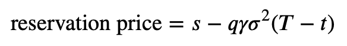
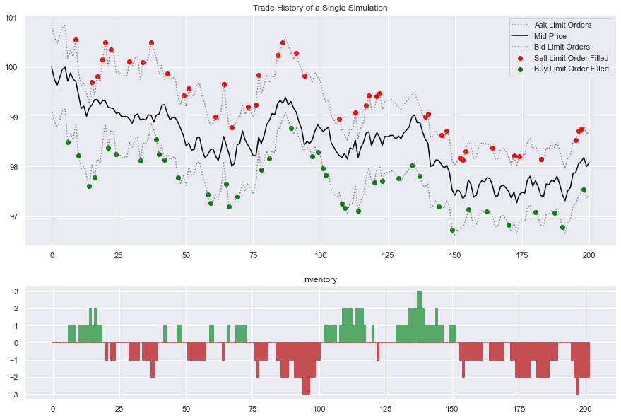

# Market Making Strategy with Crypto

In this notebook, I will be implementing the market-making methodology outlined in Avellaneda and Stoikov's popular market making whitepaper titled High-Frequency Trading in a Limit Order Book. The paper can be found for free here: https://www.math.nyu.edu/~avellane/HighFrequencyTrading.pdf

In the whitepaper, the optimal behaviour of a market maker given certain assumptions is derived. Ultimately, this derivation yields a spread used to calculate the optimal placement for limit order, which is defined as follows:

This spread is defined around a reservation price i.e. a price at which a market maker is indifferent between their current portfolio and their current portfolio $\pm$ a new share. The reservation price is derived in the whitepaper as follows:

We can get an idea of how this model works by considering the following chart:

